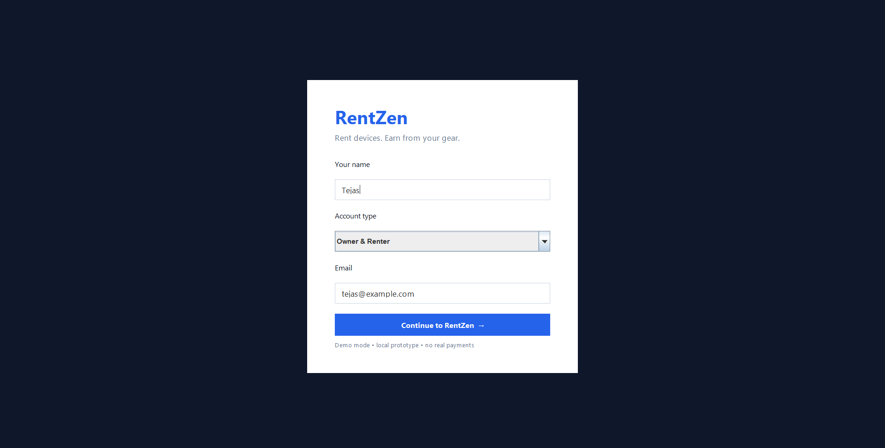
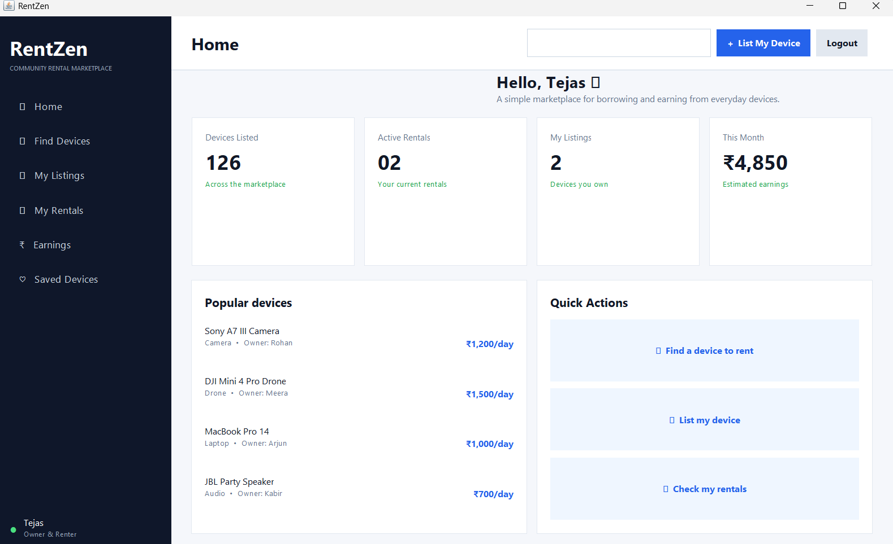

# RENTZEN - GENERAL DEVICE RENTAL MARKETPLACE

## Project Overview

RENTZEN is a Java-based peer-to-peer device rental marketplace where users can list, discover, and rent devices for short-term use. Owners can earn from unused devices, while renters can access equipment without purchasing it.

## Preview

## Features

- User login with Owner, Renter, and Owner & Renter roles.
- Browse and search available devices.
- Add and manage device listings.
- Rent available devices.
- Rental confirmation with Rental ID.
- View and manage rental records.
- Return rented devices.
- View rental earnings.
- Role-based access control.

## Technologies / Tools Used

- **Java**
- **Java Swing**
- **Java Collections**
- **Git & GitHub**

The project does not require Maven, JavaFX, JavaScript, or third-party libraries.

## Installation & Run

### Requirements

- Java JDK installed on the system.

Check Java installation:

    java -version
    javac -version

### Run on Windows

    .\run.bat

### Manual Run

    javac -encoding UTF-8 -d out src\Main.java
    java -cp out Main

## Testing

The following features can be tested:

- Login and role selection.
- Browse and search devices.
- Add a device listing.
- Confirm a rental.
- Verify Rental ID and rental status.
- Return a rented device.
- Verify device becomes available again.
- Test role-based access.
- Test unavailable device handling.
- Test invalid input handling.

